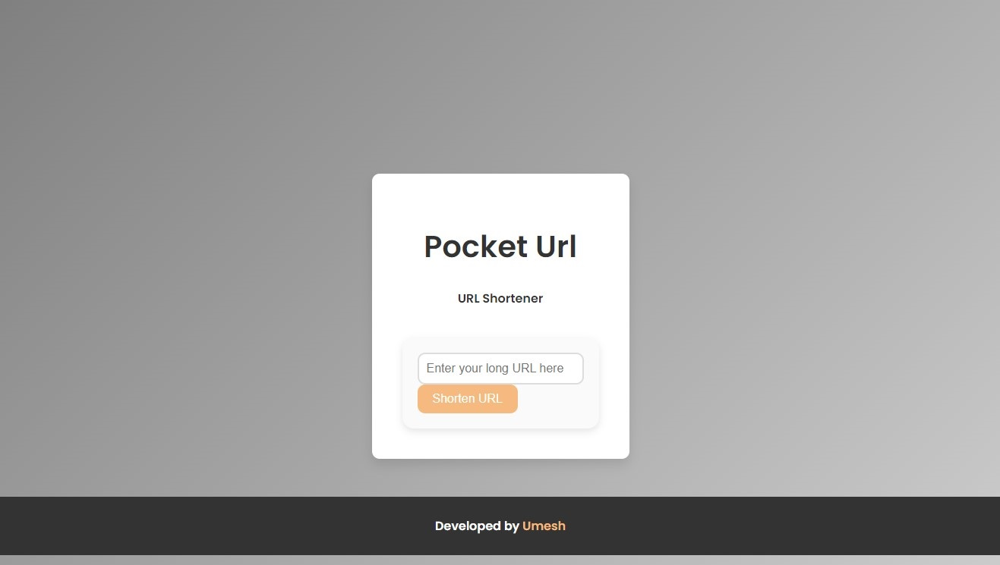
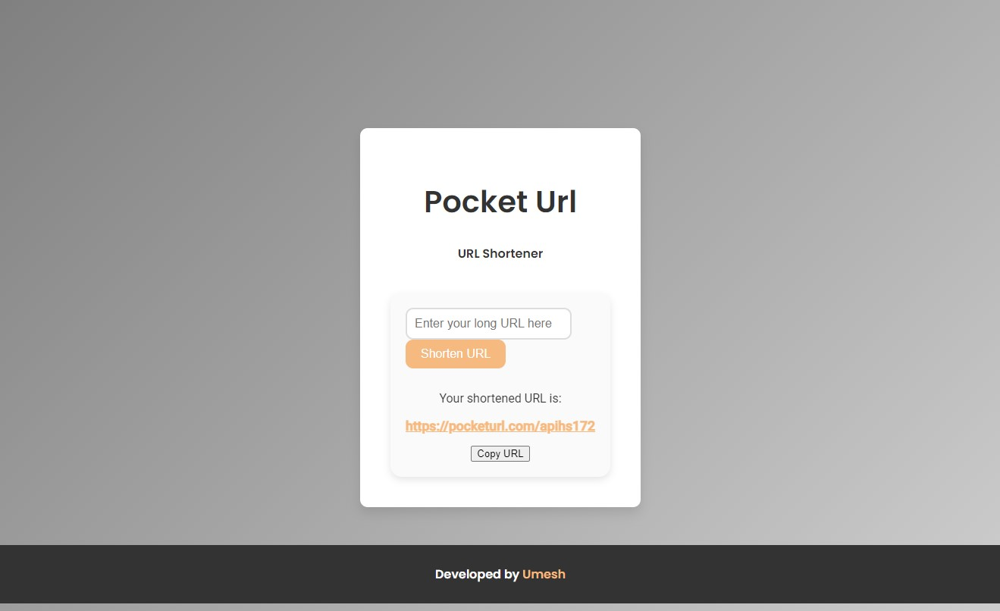

# PocketURL - URL Shortener App

## Overview
The URL Shortener app is a simple web application that allows users to shorten long URLs. It provides a clean and easy-to-use interface to generate short, manageable links.

#### Live Demo Check out the live application: [PocketURL](https://pocketurl-chc2.onrender.com/)

## Screenshots



## Installation
1. **Clone the repository:**
    ```sh
    git clone https://github.com/umesh-here/pocketurl.git
    ```
2. **Navigate to the project directory:**
    ```sh
    cd pocketurl
    ```
3. **Build the application:**
    ```sh
    ./mvnw clean install
    ```

## Usage
1. **Run the application:**
    ```sh
    ./mvnw spring-boot:run
    ```
2. **Open your browser and go to:**
    ```sh
    http://localhost:8080
    ```
3. **Enter the URL you want to shorten and click "Shorten".**

## Built With
- **Framework:** Spring Boot
- **Language:** Java
- **Frontend:** HTML, CSS, Thymeleaf
- **Database:** H2, MySQL, or MongoDB

## Contributing
We welcome contributions to enhance the functionality and usability of the URL Shortener app! If you're interested in contributing, please follow these steps:

1. **Fork the repository**
2. **Create your feature branch:**
    ```sh
    git checkout -b feature/your-feature-name
    ```
3. **Commit your changes:**
    ```sh
    git commit -m 'Add some feature'
    ```
4. **Push to the branch:**
    ```sh
    git push origin feature/your-feature-name
    ```
5. **Submit a pull request**

We appreciate your support and contributions to the project!


